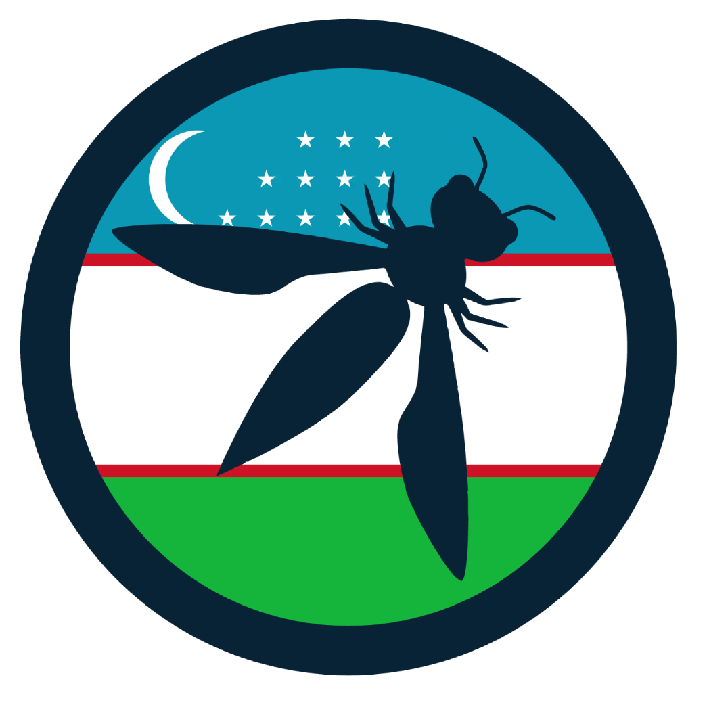

---

layout: col-sidebar
title: OWASP Tashkent
tags: tashkent owasp-tashkent uzbekistan
region: Asia
meetup-group: owasp-tashkent
country: Uzbekistan

---

## Welcome

Welcome to the OWASP Tashkent Chapter!

The Tashkent chapter of OWASP is located in Uzbekistan and is a part of a larger non-profit organization. This chapter is relatively new, having been established in 2025, and is still growing in size and reach. It serves as a platform for individuals interested in application security to come together, share knowledge, and hold events. The chapter regularly organizes meetups to discuss various topics related to security and invites members of the community to participate. By attending these events, members can learn from each other and stay updated on the latest developments in the field. Overall, the Tashkent chapter aims to build a strong local community focused on improving software security.
